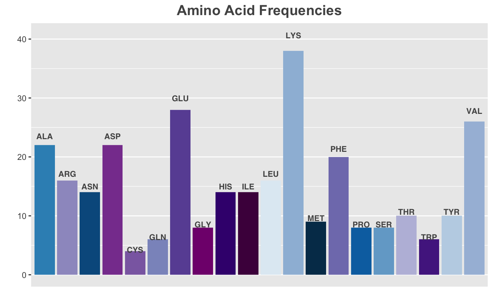

# R: Visualize Amino Acid Frequencies in a Protein

I want to import a pdb file from the Protein Data Bankinto R, display the protein sequence, 
and make a visualization showing the frequencies of each amino acid. I want to use ggplot2 
to do the visualization. The amino acid labels should display as three letter codes instead
of one letter. Instead of the labels appearing as ticks along the x axis, I want them to 
sit on top of the bars in the chart. I also wanted to make my own custom color palette, and Chat 
showed me how to randomize the colors in it with the sample function.

Note: ChatGPT gave a function pdb2seq to extract the protein sequence, but it appears to
not exist. Function pdbseq, shown in the code, works. The aa1 = FALSE gives the three letter
codes instead of one letter. 

***ChatGPT***
*I can help you with that. To import a PDB file into R, you can use the bio3d package, 
which is a useful tool for working with biological structure data. You can create 
a more customizable and aesthetically pleasing plot using the ggplot2 package. 
Here's an example of how to visualize the amino acid frequencies with ggplot2*

```r
library(bio3d)
library(ggplot2)

pdb <- read.pdb("path/to/your/file.pdb")

print(pdb)

# Get the protein sequence
protein_seq <- pdbseq(pdb, aa1 = FALSE)
print(protein_seq)

# Create a data frame for ggplot
aa_counts <- data.frame(AminoAcid = names(table(protein_seq)), Frequency = as.numeric(table(protein_seq)))

# Create a custom palette
my_pal <- sample(c("#e0ecf4", "#bfd3e6", "#9ebcda", "#8c96c6", "#8c6bb1", "#88419d",
            "#810f7c", "#4d004b", "#a6bddb", "#74a9cf", "#3690c0", "#0570b0",
            "#045a8d", "#023858", "#bcbddc", "#9e9ac8", "#807dba", "#6a51a3",
            "#54278f", "#3f007d"))

# Create a bar plot with ggplot2
ggplot(aa_counts, aes(x = AminoAcid, y = Frequency, fill = AminoAcid)) +
  geom_bar(stat = "identity") +
  geom_text(aes(label = AminoAcid), position = position_stack(vjust = 1.07), 
            color = "#525252",    # Set text color to white
            size = 3,            # Set text size
            fontface = "bold",   # Set font style to bold
            family = "sans"     # Set font family
            #angle = 45,          # Rotate text by 45 degrees
            #hjust = 0.5) +        # Set horizontal justification
            ) + 
  scale_x_discrete(labels = NULL, breaks = NULL) + 
  scale_fill_manual(values = my_pal) +
  labs(title = "Amino Acid Frequencies", x = " ", y = " ") +
  theme_gray() +
  guides(fill = FALSE) +
  theme(axis.ticks.x = element_blank(),  # Hide both x-axis text and ticks
        plot.title = element_text(color = "#525252",         # Set title color
                                   size = 15,            # Set title size
                                   face = "bold",        # Set title style
                                   hjust = 0.5))

```

*Resulting image:*


